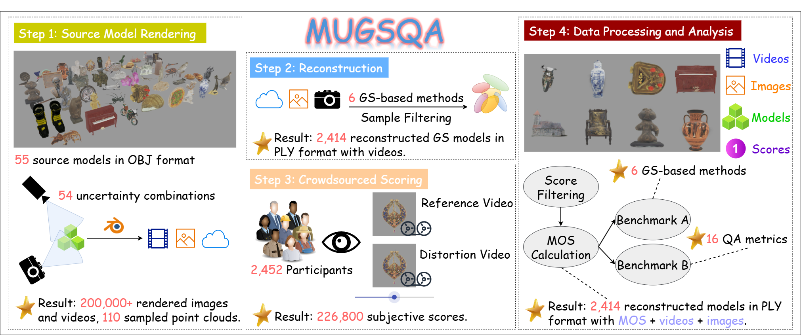

# MUGSQA (Multi-Uncertainty-Based Gaussian Splatting Quality Assessment) Dataset

<a href="https://arxiv.org/abs/2511.06830"></a>
<a href="https://huggingface.co/datasets/Solivition/MUGSQA"></a>

<p align="left">
    
</p>

Official repository for the <strong>ICASSP 2026 Oral</strong> Paper <strong>MUGSQA: Novel Multi-Uncertainty-Based Gaussian Splatting Quality Assessment Method, Dataset, and Benchmarks</strong>.

This repository ships:

* the **MUGSQA dataset specification** — folder layout, naming convention, and MOS annotations (see [Dataset Structure](#dataset-structure))
* a minimal **benchmark toolkit** ([`benchmark/`](benchmark/)) to compute, fine-tune, and correlate IQA / VQA metrics against the released MOS (see [Benchmark](#benchmark))
* the full **dataset construction pipeline** ([`render_inputs/`](render_inputs/) + [`reconstruction/`](reconstruction/)) to regenerate or extend MUGSQA from scratch (see [Dataset Construction](#dataset-construction))


## 📃Dataset Summary

**MUGSQA** is a large-scale dataset designed for **Gaussian Splatting Quality Assessment (GSQA)**. It is constructed by introducing multiple uncertainties during the reconstruction process and collecting large-scale subjective quality scores.

The dataset contains **2,414 reconstructed Gaussian models**, each paired with rendered videos and Mean Opinion Scores (MOS). It supports research on:

* Gaussian Splatting quality assessment
* reconstruction robustness evaluation
* rendering-based and rendering-free quality metrics

The dataset simulates several uncertainties that commonly occur during reconstruction, including:

* input view resolution
* number of input views
* view-to-object distance
* initialization of the point cloud
* method of GS reconstruction

These factors create diverse reconstruction distortions that are useful for benchmarking reconstruction methods and quality metrics. 


## 📁Dataset Structure

The dataset repository contains the following files:

```
reference/
main.tar.gz
additional.tar.gz
mos_main.xlsx
mos_additional.xlsx
```

### 1. Reference Videos

```
reference/
```

This folder contains **ground-truth reference videos** rendered from the original source objects. Due to copyright restrictions, the original 3D mesh models are not included. Only the rendered reference videos are provided. These videos are used in the subjective quality assessment experiments as reference stimuli.

### 2. Main Set
```
main.tar.gz
```

After extraction:

```
main/
├── sample_folder_1/
├── sample_folder_2/
...
└── sample_folder_1970/
```

The **main set contains 1,970 reconstructed Gaussian objects**. Each sample folder represents one distorted reconstruction generated under specific uncertainty settings.

#### 2.1. Naming Convention

Each sample folder follows the format:

```
modelname_resolution_views_distance_method_pointcloud
```

Example:

```
12th-c-ce-water-moon-guanyin_480res_9views_5distance_lgs_rndpc
```

Where:
| Field      | Description               |
| ---------- | ------------------------- |
| modelname  | name of the source object |
| resolution | input view resolution     |
| views      | number of input views     |
| distance   | view-to-object distance   |
| method     | reconstruction method     |
| pointcloud | initial point cloud type  |

These parameters correspond to the reconstruction uncertainty settings used during dataset generation.

#### 2.2. Files inside each sample folder

Each distorted sample folder contains two files with the same name:

```
sample_name.mp4
sample_name.ply
```

| File   | Description                                         |
| ------ | --------------------------------------------------- |
| `.mp4` | rendered video of the reconstructed Gaussian object |
| `.ply` | reconstructed 3D Gaussian model                     |

### 3. Additional Set

```
additional.tar.gz
```

After extraction:

```
additional/
├── sample_folder_1/
...
└── sample_folder_444/
```

The **additional set contains 444 reconstructed samples**. Unlike the main set, the additional set includes reconstructions generated using multiple Gaussian Splatting methods:

* 3DGS
* Mip-Splatting
* Scaffold-GS
* EAGLES
* Octree-GS

All other settings are consistent with the main set.

### 4. MOS Annotations

The subjective quality scores are stored in:

```
mos_main.xlsx
mos_additional.xlsx
```

Each entry corresponds to one distorted sample and its **Mean Opinion Score (MOS)**. MOS values represent perceptual quality collected through a large-scale subjective study. Higher MOS indicates better perceived quality, and the MOS range is 0 to 5.


## 🧰Usage Example

Example workflow:

1. Extract the dataset archives:

```
tar -xzf main.tar.gz
tar -xzf additional.tar.gz
```

2. Load reconstructed models:

```
sample_folder/
├── sample_name.mp4
└── sample_name.ply
```

3. Use the `.ply` files for rendering-free quality assessment or use the `.mp4` files for rendering-based quality assessment.

4. Match the sample name with the corresponding MOS score in the Excel files.


## 📊Benchmark

A minimal benchmark toolkit lives in [`benchmark/`](benchmark/) and covers the three operations needed to reproduce or extend the paper's evaluation:

1. **Compute** per-video IQA / VQA scores — [`calculate_metrics.py`](benchmark/calculate_metrics.py)
2. **Fine-tune** a learning-based metric with 5-fold cross-validation — [`finetune_metrics.py`](benchmark/finetune_metrics.py)
3. **Correlate** any metric CSV against the released MOS — [`compute_correlation.py`](benchmark/compute_correlation.py)

All three scripts read the released dataset directly — no intermediate format conversion is required.

### Environment

```bash
conda create -n mugsqa-bench python=3.10 -y
conda activate mugsqa-bench
pip install -r benchmark/requirements.txt
```

The exact pinned set lives in [`benchmark/requirements.txt`](benchmark/requirements.txt) (`pyiqa`, `torch`, `pandas`, `scipy`, `scikit-learn`, `opencv-python`, `openpyxl`, `Pillow`, `tqdm`).

### Layout assumed by the scripts

Once `main.tar.gz` and `additional.tar.gz` are extracted, point `--dataset_dir` at the parent that holds the three release folders:

```
<dataset_dir>/
├── reference/<object>_*.mp4
├── main/<sample>/<sample>.mp4         # 1,970 distorted videos (+ .ply)
├── additional/<sample>/<sample>.mp4   # 444 distorted videos   (+ .ply)
├── mos_main.xlsx
└── mos_additional.xlsx
```

The MOS files must contain a `video_name` column (matching the distorted `.mp4` filenames) and an `MOS` column. Reference and distorted videos are paired by the leading `<object>` token of the filename (everything before the first underscore).

### 1. Compute metric scores

Any metric registered with [pyiqa](https://github.com/chaofengc/IQA-PyTorch) works — full-reference (PSNR, SSIM, MS-SSIM, LPIPS, VIF, …), no-reference (NIQE, PIQE, DBCNN, …), or distribution-based (FID):

```bash
python benchmark/calculate_metrics.py \
    --dataset_dir /path/to/MUGSQA \
    --subset      main              \
    --metric      psnr              \
    --output_dir  benchmark/all_frames
```

Each run writes one CSV per metric:

```
benchmark/all_frames/<metric>_<subset>.csv     # columns: video_name, score, lower_better
```

FID is the only special case: it expects pre-extracted frame folders sitting next to each `.mp4` (named after the video stem). All other metrics decode the videos on the fly.

### 2. Fine-tune a learnable metric

5-fold cross-validation, best-by-PLCC checkpoint per fold, and averaged correlation across folds:

```bash
python benchmark/finetune_metrics.py \
    --dataset_dir  /path/to/MUGSQA                    \
    --subset       main                               \
    --mos_xlsx     /path/to/MUGSQA/mos_main.xlsx      \
    --metrics      dbcnn                              \
    --output_dir   benchmark/finetune                 \
    --weights_dir  benchmark/weights                  \
    --epochs       50
```

Produces:

```
benchmark/weights/<metric>/<metric>_fold<k>_best.pth   # k = 1..5
benchmark/finetune/average_results_<subset>.csv        # avg PLCC / SRCC / KRCC / RMSE
```

Pass several metrics at once with `--metrics dbcnn niqe piqe`.

### 3. Correlate against MOS

Given any per-video metric CSV (output of step 1 or your own predictions) and the released MOS xlsx, compute the four standard coefficients with VQEG-style logistic fitting:

```bash
python benchmark/compute_correlation.py \
    --mos_xlsx    /path/to/MUGSQA/mos_main.xlsx       \
    --metric_csv  benchmark/all_frames/psnr_main.csv  \
    --fit_scale   logistic_4params
```

Prints `PLCC / SRCC / KRCC / RMSE` to stdout. Use `--fit_scale none` to skip the logistic and compute raw PLCC / RMSE on the metric scores directly.


## 🔨Dataset Construction

> Only required if you want to **regenerate or extend** MUGSQA. To simply use the released dataset, the section above is enough.

The construction pipeline has two stages: (1) **render** reference videos and input views from each source object with Blender; (2) **reconstruct** every distortion setting with one of the supported Gaussian-Splatting methods. Stage 1 lives in [`render_inputs/`](render_inputs/), stage 2 in [`reconstruction/`](reconstruction/).

### Stage 1 — Render with Blender (`render_inputs/`)

Tested with **Blender 3.6.18**. The source layout expected by these scripts is:

```
<MUGSQA_SOURCE>/
├── object_1/
│   └── source/                # original .obj + .mtl + textures
├── object_2/
│   └── source/
...
```

Three modes, each invoked through the same launcher:

```bash
cd render_inputs

# Mode 0 — Scale every mesh to a unit bounding box (writes object_*/calibrated/).
python call_blender.py --mode 0 \
    --blender_location /path/to/blender-3.6.18-linux-x64/blender \
    --obj_save_dir     /path/to/MUGSQA_SOURCE

# Mode 2 — Render the reference video + sample the GT/random point clouds
#          (writes object_*/calibrated/render/{GT_video.mp4, points3d_gt.ply, points3d_rnd.ply}).
python call_blender.py --mode 2 \
    --blender_location /path/to/blender-3.6.18-linux-x64/blender \
    --obj_save_dir     /path/to/MUGSQA_SOURCE

# Mode 1 — Render distorted input-view grids across (resolution x views x distance).
#          Default sweep: res {1080,720,480} x views {72,36,9} x distance {5,2,1}.
python call_blender.py --mode 1 \
    --blender_location /path/to/blender-3.6.18-linux-x64/blender \
    --obj_save_dir     /path/to/MUGSQA_SOURCE
```

After Stage 1, each object folder looks like:

```
object_1/
├── calibrated/
│   ├── object_1.obj           # scaled mesh
│   └── render/                # reference video + GT/rnd point clouds
└── distortion/
    └── <res>res_<views>views_<distance>distance/
        └── render/            # input views + transforms_*.json zipped
```

### Stage 2 — Reconstruct (`reconstruction/`)

Each subfolder under [`reconstruction/`](reconstruction/) is a **patch overlay** for one upstream Gaussian-Splatting repository — only the files that differ from upstream are kept. The shared driver [`reconstruction/train_all.py`](reconstruction/train_all.py) is method-agnostic and sweeps the full `(res × views × distance)` grid.

#### Supported methods

| Tag (`--method`)    | Patch folder                                                                  | Upstream repo                                                                | Training script (`--train_script`) |
| ------------------- | ----------------------------------------------------------------------------- | ---------------------------------------------------------------------------- | ---------------------------------- |
| `3dgs`              | [reconstruction/gaussian-splatting/](reconstruction/gaussian-splatting/)      | https://github.com/graphdeco-inria/gaussian-splatting                        | `train.py`                         |
| `mip-splatting`     | [reconstruction/mip-splatting/](reconstruction/mip-splatting/)                | https://github.com/autonomousvision/mip-splatting                            | `train.py`                         |
| `lgs`               | [reconstruction/lightgaussian/](reconstruction/lightgaussian/)                | https://github.com/VITA-Group/LightGaussian                                  | `train_densify_prune.py`           |
| `scaffold-gs`       | [reconstruction/scaffold-gs/](reconstruction/scaffold-gs/)                    | https://github.com/city-super/Scaffold-GS                                    | `train.py`                         |
| `octree-gs`         | [reconstruction/octree-gs/](reconstruction/octree-gs/)                        | https://github.com/city-super/Octree-GS                                      | `train.py`                         |
| `efficient`         | [reconstruction/efficientgaussian/](reconstruction/efficientgaussian/)        | https://github.com/Sharath-girish/efficientgaussian                          | `train_eval.py`                    |

#### Setup (per method)

Each method ships its own conda environment. The general recipe — adapt versions to each upstream's `requirements.txt`:

```bash
conda create -n mugsqa-<method> python=3.9
conda activate mugsqa-<method>
conda install nvidia/label/cuda-12.1.0::cuda-toolkit
pip install torch==2.1.1 torchvision==0.16.1 torchaudio==2.1.1 \
    --index-url https://download.pytorch.org/whl/cu121

# Inside the upstream repo:
pip install submodules/diff-gaussian-rasterization
pip install submodules/simple-knn
pip install opencv-python trimesh icecream tqdm plyfile pyyaml
```

#### Apply the patch and run

```bash
# 1. Clone the upstream repo, install it, then overlay our patch.
git clone <upstream-repo-url> /path/to/<method>-repo
cp -r reconstruction/<method-folder>/* /path/to/<method>-repo/
cp    reconstruction/train_all.py      /path/to/<method>-repo/

# 2. Smoke-test on a single sample.
cd /path/to/<method>-repo
python <train_script> \
    -s /path/to/MUGSQA_SOURCE/<object>/distortion/480res_9views_1distance/render \
    -m /tmp/smoke_test --port 6013

# 3. Full sweep (GT point cloud + evaluation video).
python train_all.py \
    --dataset_dir   /path/to/MUGSQA_SOURCE \
    --method        <tag> \
    --train_script  <train_script> \
    --gtpc --generate_video \
    --port 6009
```

`train_all.py` writes reconstructions and rendered videos in-place:

```
distortion/<res>res_<views>views_<distance>distance/
├── render/                              # (from Stage 1)
└── <method>_<gtpc|rndpc>/
    ├── point_cloud/iteration_30000/    # reconstructed .ply
    └── video/                           # evaluation .mp4 (if --generate_video)
```

Useful flags:

- `--gtpc` — initialize from `points3d_gt.ply`; omit for the `_rndpc` setting.
- `--gpu N` — forwarded as `--gpu N` to the upstream trainer. **Required for LightGaussian, Scaffold-GS, and Octree-GS.**
- `--res / --views / --distance` — restrict the sweep, e.g. `--res 480 --views 9 --distance 1` reconstructs only that single cell.
- `--generate_video` — render the evaluation video after each successful training run; existing `video/` folders are skipped.

The driver is idempotent: completed training runs (detected via `point_cloud/iteration_30000/`) and existing `video/` folders are automatically skipped, so it is safe to re-launch after interruption.

## 🔗Citation
```latex
@inproceedings{chen2026mugsqa,
  title={{MUGSQA: Novel Multi-Uncertainty-Based Gaussian Splatting Quality Assessment Method, Dataset, and Benchmarks}}, 
  author={Tianang Chen and Jian Jin and Shilv Cai and Zhuangzi Li and Weisi Lin},
  booktitle={Proc. ICASSP},
  year={2026}
}
```
